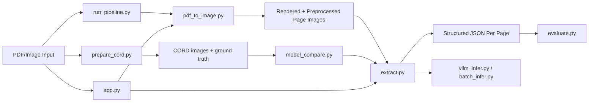

# VLM PDF Extraction Assignment

Simple end-to-end document understanding pipeline built for the Antares AI/ML Engineer assignment. The repo uses the real CORD dataset for quantitative model evaluation and uses reportlab-generated PDFs only for PDF ingestion demos.

## What This Builds

- PDF to image conversion with light preprocessing
- Open-source VLM inference for structured extraction
- Signature detection and filled/empty form-field inspection
- JSON output per page
- Evaluation with exact match, precision, recall, and F1
- CORD benchmark comparison across two open-source VLMs
- Reportlab PDF samples for end-to-end PDF testing
- Simple demo UI and optional acceleration helpers

## Model Choice

Primary model: `Qwen/Qwen2.5-VL-3B-Instruct`

- Chosen because Qwen2.5-VL explicitly targets document parsing, OCR-heavy understanding, tables, and forms in its technical report and release notes.
- The 3B checkpoint stays safely within the assignment limit of 13B and is realistic for a local or Colab workflow.
- It tends to follow strict JSON instructions better than smaller lightweight models.

Comparison model: `HuggingFaceTB/SmolVLM2-2.2B-Instruct`

- Chosen as the lightweight baseline.
- Its model card reports strong small-model document VQA performance and it is easier to run on constrained hardware.
- This gives a clear quality-vs-speed comparison instead of comparing two near-identical models.

Sources:

- CORD dataset: https://huggingface.co/datasets/naver-clova-ix/cord-v2
- Qwen2.5-VL model card: https://huggingface.co/Qwen/Qwen2.5-VL-3B-Instruct
- Qwen2.5-VL release blog: https://qwenlm.github.io/blog/qwen2.5-vl/
- Qwen2.5-VL technical report summary: https://huggingface.co/papers/2502.13923
- SmolVLM2 model card: https://huggingface.co/HuggingFaceTB/SmolVLM2-2.2B-Instruct
- Hugging Face multimodal chat docs: https://huggingface.co/docs/transformers/chat_templating_multimodal

## Architecture



Pipeline summary:

1. `run_pipeline.py` is the main CLI entrypoint for PDFs, images, or folders.
2. `pdf_to_image.py` renders PDF pages with PyMuPDF and applies light preprocessing: deskew, denoise, grayscale, and resize.
3. `extract.py` loads the selected VLM, applies a task-specific prompt, and writes one JSON output per page.
4. `evaluate.py` compares prediction JSON files with ground-truth JSON files using exact match, precision, recall, and F1.
5. `prepare_cord.py` prepares real CORD receipt images and normalized labels for benchmarking, and `model_compare.py` runs both VLMs on the same subset.
6. `app.py` exposes the same preprocessing and extraction flow in a small Streamlit demo.

## Repository Layout

```text
.
├── app.py
├── batch_infer.py
├── config.yaml
├── Dockerfile
├── environment.yml
├── evaluate.py
├── extract.py
├── finetune_lora.py
├── cord_utils.py
├── generate_sample_pdfs.py
├── model_compare.py
├── prepare_cord.py
├── pdf_to_image.py
├── README.md
├── requirements.txt
├── run_pipeline.py
├── vllm_infer.py
├── WRITEUP.md
├── data/
└── results/
```

## Setup

Python version: `3.11`

```bash
conda env create -f environment.yml
conda activate vlm-pdf
```

### Model download

The models are downloaded automatically from Hugging Face the first time you run inference. The code does this through `AutoProcessor.from_pretrained(...)` and `AutoModelForImageTextToText.from_pretrained(...)`.

Default model:

- `Qwen/Qwen2.5-VL-3B-Instruct`

Comparison model:

- `HuggingFaceTB/SmolVLM2-2.2B-Instruct`

First-run notes:

- Make sure the machine has internet access for the first inference run.
- The first run will take longer because model weights and processors are cached locally.
- If needed, you can pre-download by running one of the pipeline commands below once.

## Commands To Run

These are the only commands needed to reproduce the assignment deliverables in this repo.

### 1. Prepare CORD evaluation data

```bash
python prepare_cord.py --split validation --limit 10 --output-dir data/cord
```

### 2. Compare both VLMs on CORD receipts

```bash
python model_compare.py --input data/cord/images --ground-truth-dir data/cord/ground_truth --task-name cord_receipt
```

This writes the main quantitative results to:

- `results/evaluation/qwen2_5_vl_3b_metrics.csv`
- `results/evaluation/smolvlm2_2b_metrics.csv`
- `results/evaluation/model_comparison_summary.csv`

### 3. Generate sample PDFs for qualitative testing

```bash
python generate_sample_pdfs.py
```

### 4. Run end-to-end extraction on the sample PDFs

Generic structured extraction:

```bash
python run_pipeline.py --input results/pdf_samples --output-dir results/pdf_outputs --task-name generic_document
```

Signature detection:

```bash
python run_pipeline.py --input results/pdf_samples --output-dir results/pdf_signature_outputs --task-name signature_check --ground-truth-dir data/pdf_ground_truth
```

Form field filled/empty detection:

```bash
python run_pipeline.py --input results/pdf_samples --output-dir results/pdf_form_outputs --task-name form_fields --ground-truth-dir data/pdf_ground_truth
```

The pipeline writes one JSON file per processed page and, when ground truth is provided, updates `results/evaluation/metrics_summary.csv`.

### 5. Launch the demo UI

```bash
streamlit run app.py
```

## Prompting Strategy

The extraction strategy is intentionally strict, task-aware, and JSON-first:

- one system message
- one user message with the page image
- a fixed task-specific JSON schema
- `null` for missing values
- no markdown fences
- internal reasoning only, with final output restricted to JSON
- a second repair pass if the first answer is invalid or off-schema

This worked better than loose prompts or explicit chain-of-thought because it kept the output machine-readable while still encouraging the model to reason about document type, key entities, and field consistency before answering. The repair pass improves robustness without changing the evaluator-facing output format.

Implemented task prompts:

- `generic_document`: full extraction in one JSON
- `key_value_pairs`: extract all key-value pairs
- `signature_check`: return yes/no for signature presence
- `form_fields`: return field name + filled/empty status
- `receipt_summary`: return vendor name, date, and total amount
- `cord_receipt`: CORD-specific receipt extraction

For better document question answering and extraction quality, the main prompt pattern is:

- shared system rules across tasks
- task-specific user prompts and schemas
- implicit step-by-step reasoning rather than exposed reasoning text
- schema repair on malformed first-pass outputs

This is a better fit for this repository than explicit chain-of-thought because the pipeline is evaluated on structured JSON, not free-form reasoning quality.

## Core Files

- [pdf_to_image.py](/Users/sushantravva/Desktop/vlm-extraction-assignment/pdf_to_image.py)
- [extract.py](/Users/sushantravva/Desktop/vlm-extraction-assignment/extract.py)
- [evaluate.py](/Users/sushantravva/Desktop/vlm-extraction-assignment/evaluate.py)
- [run_pipeline.py](/Users/sushantravva/Desktop/vlm-extraction-assignment/run_pipeline.py)

## Bonus Coverage

- Compare 2 VLMs: `model_compare.py`
- Minimal UI: `app.py`
- LoRA starter: `finetune_lora.py`
- Faster batch path: `batch_infer.py` and optional `vllm_infer.py`
- Docker: `Dockerfile`

## Evaluation Design

- Quantitative evaluation is done only on real CORD receipt images and labels.
- The compare script runs both `qwen2_5_vl_3b` and `smolvlm2_2b` on the same prepared CORD subset.
- The PDFs generated with `reportlab` are for testing PDF-to-image conversion and end-to-end pipeline behavior only, not for benchmark scoring.
- `prepare_cord.py` also writes `data/cord/metadata.csv` so the benchmark subset is explicit and reproducible.
- `generate_sample_pdfs.py` also writes `data/pdf_ground_truth/` so signature detection and form-field extraction can be evaluated on labeled PDFs.

## Results

After running the scripts, the main folders are:

- `data/cord/images/`
- `data/cord/ground_truth/`
- `data/cord/metadata.csv`
- `results/compare_qwen2_5_vl_3b/`
- `results/compare_smolvlm2_2b/`
- `results/evaluation/`
- `results/pdf_samples/`
- `results/pdf_samples_metadata/`
- `results/pdf_outputs/`

Important files produced by the benchmark:

- `results/evaluation/qwen2_5_vl_3b_metrics.csv`
- `results/evaluation/smolvlm2_2b_metrics.csv`
- `results/evaluation/model_comparison_summary.csv`

## Reproducibility Notes

- No dependency versions are pinned, as requested.
- Main path is intentionally simple and readable for interview explanation.
- For a stronger benchmark run, increase the CORD subset size or run the full validation split on Colab/Linux GPU.
