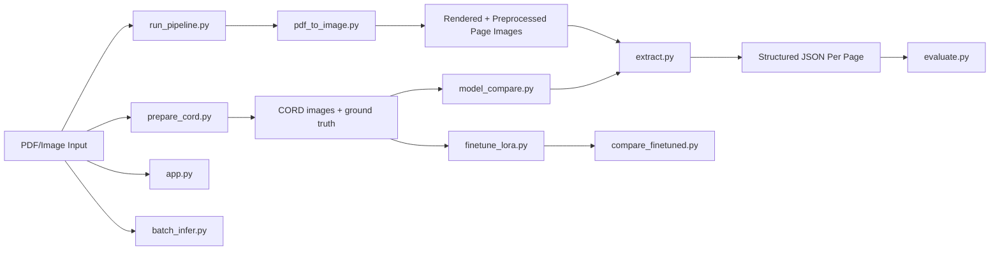

# VLM PDF Extraction Assignment

This repository implements an end-to-end document extraction pipeline built around open-source vision-language models. The project uses the real CORD dataset for quantitative receipt evaluation and uses generated PDFs only for PDF-ingestion and task-behavior demos.

## What This Builds

- PDF and image ingestion with page-level preprocessing
- Structured JSON extraction from business documents
- Task-specific prompting for receipts, forms, signatures, and generic documents
- Quantitative evaluation with exact match, precision, recall, and F1
- Head-to-head model comparison on the same CORD subset
- Optional LoRA fine-tuning and base-vs-finetuned comparison
- Streamlit demo for interactive testing
- Helper .ipynb notebook which is used to run the experiments. (With T4 GPU on colab)

## Model Selection

Primary model: `Qwen/Qwen2.5-VL-3B-Instruct`

Why this was the strongest primary choice for the assignment:

- The assignment is not just OCR. It requires visually grounded extraction, instruction following, schema discipline, and reasoning over document structure. Qwen2.5-VL is a better fit than a generic image-captioning model because it is explicitly designed for document-style multimodal understanding.
- The 3B checkpoint stays well below the 13B limit while still offering enough capacity for multi-step extraction tasks such as distinguishing subtotal from total, identifying filled versus empty fields, and obeying strict JSON output requirements.
- In this pipeline, formatting reliability matters almost as much as raw recognition quality. A model that often drifts out of schema creates downstream evaluation noise and extra repair logic. Qwen was selected because it is a stronger instruction-following model for machine-readable outputs.
- It is also a practical engineering choice: large enough to be credible for document extraction, small enough to run in a realistic local or Colab-style setup.

Comparison model: `HuggingFaceTB/SmolVLM2-2.2B-Instruct`

Why this was chosen as the baseline:

- A useful baseline should test a different point on the quality-vs-efficiency curve, not just be a near-duplicate of the primary model.
- SmolVLM2-2.2B is materially smaller, cheaper to run, and easier to fit on constrained hardware, which makes it a good efficiency reference.
- Comparing Qwen2.5-VL-3B against SmolVLM2-2.2B helps answer the practical question behind the assignment: how much extraction quality is gained by moving from a very small VLM to a stronger but still modest open model.

Alternatives considered:

- Donut-style models are strong for narrow document extraction but are less attractive here because the assignment spans multiple task types, not just receipt parsing.
- LLaVA-family models are broadly capable, but for this assignment I prioritized models with stronger document/OCR-centric positioning over general visual chat performance.

Sources:

- CORD dataset: https://huggingface.co/datasets/naver-clova-ix/cord-v2
- Qwen2.5-VL model card: https://huggingface.co/Qwen/Qwen2.5-VL-3B-Instruct
- Qwen2.5-VL release blog: https://qwenlm.github.io/blog/qwen2.5-vl/
- Qwen2.5-VL technical report summary: https://huggingface.co/papers/2502.13923
- SmolVLM2 model card: https://huggingface.co/HuggingFaceTB/SmolVLM2-2.2B-Instruct
- Hugging Face multimodal chat docs: https://huggingface.co/docs/transformers/chat_templating_multimodal

## Architecture



## Technical Decisions

The project was designed around a few engineering constraints:

- The model had to be open source and below 13B parameters.
- The pipeline needed to work on both PDFs and regular images.
- Outputs had to be evaluator-friendly JSON rather than free-form text.
- The benchmark needed a real labeled dataset, not synthetic-only examples.

That leads to the following design choices:

- Page-level PDF rendering instead of direct PDF text extraction.
Reason: the assignment is about visually grounded document understanding, and many real PDFs contain layout, scan artifacts, raster content, signatures, or form markings that text-only extraction would miss.

- Light preprocessing instead of aggressive cleanup.
Reason: deskewing, denoising, grayscale conversion, and bounded resizing improve readability without destroying weak visual cues like signatures, checkmarks, thin table rules, or handwritten marks.

- Task-specific prompts instead of one universal prompt.
Reason: signature detection, form-state detection, generic extraction, and CORD receipt extraction have different output contracts. Forcing one universal schema would reduce precision and make evaluation noisier.

- Strict JSON-only output with repair logic.
Reason: the downstream consumer is code, not a human reader. A mildly better natural-language answer is worse than a slightly simpler answer that is valid and parseable every time.

- Real CORD benchmarking plus synthetic PDF demos.
Reason: CORD provides real receipt labels for quantitative comparison, while generated PDFs are useful for demonstrating ingestion and task coverage beyond receipts.

- LoRA fine-tuning on the smaller baseline model.
Reason: adapting a smaller model is cheaper and makes the improvement from task-specific supervision easier to observe than adapting an already stronger primary model.

## Repository Layout

```text
.
├── app.py
├── batch_infer.py
├── compare_finetuned.py
├── config.yaml
├── cord_utils.py
├── Dockerfile
├── environment.yml
├── evaluate.py
├── extract.py
├── finetune_lora.py
├── generate_sample_pdfs.py
├── model_compare.py
├── pdf_to_image.py
├── prepare_cord.py
├── README.md
├── requirements.txt
├── run_pipeline.py
└── WRITEUP.md
```

## File Guide

- [run_pipeline.py](/Users/sushantravva/Desktop/vlm-extraction-assignment/run_pipeline.py): main CLI entrypoint for PDFs, images, and folders; orchestrates preprocessing, extraction, output writing, and optional evaluation.
- [pdf_to_image.py](/Users/sushantravva/Desktop/vlm-extraction-assignment/pdf_to_image.py): loads PDFs or images, renders pages, and applies the shared preprocessing pipeline.
- [extract.py](/Users/sushantravva/Desktop/vlm-extraction-assignment/extract.py): loads the chosen VLM, defines task prompts, parses JSON outputs, and runs repair when the first response is malformed.
- [evaluate.py](/Users/sushantravva/Desktop/vlm-extraction-assignment/evaluate.py): compares predictions against ground truth and writes exact match, precision, recall, and F1 metrics.
- [prepare_cord.py](/Users/sushantravva/Desktop/vlm-extraction-assignment/prepare_cord.py): downloads a CORD subset, normalizes labels into the project schema, and writes reproducibility metadata.
- [cord_utils.py](/Users/sushantravva/Desktop/vlm-extraction-assignment/cord_utils.py): converts raw CORD annotations into the simplified extraction target used by evaluation and training.
- [model_compare.py](/Users/sushantravva/Desktop/vlm-extraction-assignment/model_compare.py): runs the primary and comparison models on the same prepared CORD subset and summarizes the results.
- [finetune_lora.py](/Users/sushantravva/Desktop/vlm-extraction-assignment/finetune_lora.py): fine-tunes the baseline VLM with LoRA on CORD examples using the same prompt structure as inference, then saves adapter weights and training metadata.
- [compare_finetuned.py](/Users/sushantravva/Desktop/vlm-extraction-assignment/compare_finetuned.py): runs base and LoRA-adapted variants of the same model on the same input set and writes a direct comparison summary.
- [batch_infer.py](/Users/sushantravva/Desktop/vlm-extraction-assignment/batch_infer.py): lightweight batch image inference path for folders of already-rendered images when full PDF orchestration is unnecessary.
- [generate_sample_pdfs.py](/Users/sushantravva/Desktop/vlm-extraction-assignment/generate_sample_pdfs.py): creates sample PDFs plus matching metadata and ground truth for qualitative demos.
- [app.py](/Users/sushantravva/Desktop/vlm-extraction-assignment/app.py): Streamlit interface for interactive extraction runs.
- [config.yaml](/Users/sushantravva/Desktop/vlm-extraction-assignment/config.yaml): central config for default model, token budget, rendering DPI, and preprocessing settings.

## Setup

Python version: `3.11`

```bash
conda env create -f environment.yml
conda activate vlm-pdf
```

## Model Download

Models are downloaded automatically from Hugging Face the first time inference or training is run through `AutoProcessor.from_pretrained(...)` and `AutoModelForImageTextToText.from_pretrained(...)`.

Default model:

- `Qwen/Qwen2.5-VL-3B-Instruct`

Comparison / fine-tuning base model:

- `HuggingFaceTB/SmolVLM2-2.2B-Instruct`

First-run notes:

- Internet access is required for the first run.
- The first run is slower because weights and processors are cached locally.
- GPU is strongly preferred for model comparison and especially for fine-tuning.

## Commands To Run

### 1. Prepare CORD evaluation data

```bash
python prepare_cord.py --split validation --limit 10 --output-dir data/cord
```

### 2. Compare the two base VLMs on CORD

```bash
python model_compare.py --input data/cord/images --ground-truth-dir data/cord/ground_truth --task-name cord_receipt
```

Main outputs:

- `results/evaluation/qwen2_5_vl_3b_metrics.csv`
- `results/evaluation/smolvlm2_2b_metrics.csv`
- `results/evaluation/model_comparison_summary.csv`

### 3. Generate sample PDFs for qualitative testing

```bash
python generate_sample_pdfs.py
```

### 4. Run end-to-end extraction on the sample PDFs

Generic structured extraction:

```bash
python run_pipeline.py --input results/pdf_samples --output-dir results/pdf_outputs --task-name generic_document
```

Signature detection:

```bash
python run_pipeline.py --input results/pdf_samples --output-dir results/pdf_signature_outputs --task-name signature_check --ground-truth-dir data/pdf_ground_truth
```

Form field filled/empty detection:

```bash
python run_pipeline.py --input results/pdf_samples --output-dir results/pdf_form_outputs --task-name form_fields --ground-truth-dir data/pdf_ground_truth
```

### 5. Run batch inference on image folders

```bash
python batch_infer.py --input data/cord/images --output-dir results/batch_outputs --task-name cord_receipt
```

### 6. Fine-tune the baseline model with LoRA

```bash
python finetune_lora.py --model-id HuggingFaceTB/SmolVLM2-2.2B-Instruct --output-dir results/lora_adapter --train-split train --train-sample-count 32 --eval-split validation --eval-sample-count 8
```

This saves adapter weights, processor artifacts, and metadata under `results/lora_adapter/`.

### 7. Compare base vs fine-tuned baseline

```bash
python compare_finetuned.py --input data/cord/images --ground-truth-dir data/cord/ground_truth --adapter-path results/lora_adapter --base-model smolvlm2_2b --task-name cord_receipt
```

Main outputs:

- `results/evaluation/smolvlm2_2b_base_metrics.csv`
- `results/evaluation/smolvlm2_2b_finetuned_metrics.csv`
- `results/evaluation/smolvlm2_2b_finetune_comparison_summary.csv`

### 8. Launch the demo UI

```bash
streamlit run app.py
```

## Prompting Strategy

The prompting design is intentionally optimized for extraction stability rather than conversational richness.

- Each task uses a fixed schema that matches the downstream consumer.
- The system prompt enforces JSON-only behavior, short field names, and `null` for missing values.
- The user prompt changes by task because the evidence and output contracts differ across receipts, forms, signatures, and generic documents.
- The model is asked to reason internally, but not expose chain-of-thought. This keeps outputs clean and reduces formatting drift.
- A repair pass is triggered when the model returns malformed JSON or misses required top-level keys.

This strategy is stronger than a single loose prompt because it separates two failure modes:

- extraction errors
- formatting / schema errors

The repair step addresses the second failure mode without changing the underlying evaluation target.

## Evaluation Design

- CORD is used for quantitative benchmarking because it provides real receipt images and labels.
- The raw CORD annotations are normalized into a schema that is easier to compare consistently across models.
- Both candidate models are run on the same prepared subset so the comparison is controlled.
- The generated PDFs are used to show PDF ingestion, form extraction, and signature-check behavior, but not as the main benchmark.
- Fine-tuning is evaluated as a paired base-vs-adapter comparison on the same task and same ground-truth set.

## Results Folders

After running the scripts, the main folders are:

- `data/cord/images/`
- `data/cord/ground_truth/`
- `data/cord/metadata.csv`
- `results/compare_qwen2_5_vl_3b/`
- `results/compare_smolvlm2_2b/`
- `results/evaluation/`
- `results/lora_adapter/`
- `results/pdf_samples/`
- `results/pdf_samples_metadata/`
- `results/pdf_outputs/`

## Reproducibility Notes

- No dependency versions are pinned, as requested.
- `prepare_cord.py` records dataset subset metadata so benchmark runs are reproducible.
- `finetune_lora.py` saves train/eval metadata and the training configuration alongside the adapter.
- The code path is intentionally straightforward so the implementation is easy to explain during review.
